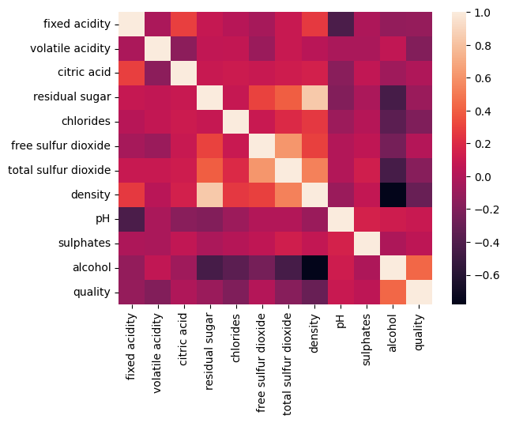

# Statistical Inference Project 2

Under the supervision of Prof. Ayon Ganguly,\
Department of Mathematics, IIT Guwahati.

## Objective

Perform regression analysis by:

- Performing point and interval estimation of all parameters
- Testing the significance of the regression
- Conducting residual analysis
- Performing subset selection
- Finding adjusted R2
- Detecting multicollinearity

## Dataset

We have taken the dataset from UC Irvine Machine Learning Repository. The dataset is related to red and white variants of the Portuguese "Vinho Verde" wine. The dataset can be found [here](https://archive.ics.uci.edu/dataset/186/wine+quality).
related research paper can be found [here](https://www.sciencedirect.com/science/article/pii/S0167923609001377?via%3Dihub). \
This dataset contains 2 files:

- winequality-red.csv
- winequality-white.csv

we have taken the white wine dataset for our analysis.

### Description of the dataset

The dataset consists of 12 columns and 4898 rows. The columns are as follows:

1. fixed acidity
2. volatile acidity
3. citric acid
4. residual sugar
5. chlorides
6. free sulfur dioxide
7. total sulfur dioxide
8. density
9. pH
10. sulphates
11. alcohol
12. quality

No missing values are present in the dataset.
first 5 rows of the dataset are as follows:
| fixed acidity | volatile acidity | citric acid | residual sugar | chlorides | free sulfur dioxide | total sulfur dioxide | density | pH  | sulphates | alcohol | quality |
|---------------|------------------|-------------|----------------|-----------|---------------------|----------------------|---------|-----|-----------|---------|---------|
| 7.0           | 0.27             | 0.36        | 20.7           | 0.045     | 45.0                | 170.0                | 1.0010  | 3.00| 0.45      | 8.8     | 6       |
| 6.3           | 0.30             | 0.34        | 1.6            | 0.049     | 14.0                | 132.0                | 0.9940  | 3.30| 0.49      | 9.5     | 6       |
| 8.1           | 0.28             | 0.40        | 6.9            | 0.050     | 30.0                | 97.0                 | 0.9951  | 3.26| 0.44      | 10.1    | 6       |
| 7.2           | 0.23             | 0.32        | 8.5            | 0.058     | 47.0                | 186.0                | 0.9956  | 3.19| 0.40      | 9.9     | 6       |
| 7.2           | 0.23             | 0.32        | 8.5            | 0.058     | 47.0                | 186.0                | 0.9956  | 3.19| 0.40      | 9.9     | 6       |

## Analysis

The analysis of the dataset is as follows:

| Statistic | fixed acidity | volatile acidity | citric acid | residual sugar | chlorides | free sulfur dioxide | total sulfur dioxide | density | pH  | sulphates | alcohol | quality |
|-----------|---------------|------------------|-------------|----------------|-----------|---------------------|----------------------|---------|-----|-----------|---------|---------|
| count     | 4898.000000   | 4898.000000      | 4898.000000 | 4898.000000    | 4898.000000 | 4898.000000        | 4898.000000         | 4898.000000 | 4898.000000 | 4898.000000 | 4898.000000 | 4898.000000 |
| mean      | 6.854788      | 0.278241         | 0.334192    | 6.391415       | 0.045772    | 35.308085           | 138.360657          | 0.994027    | 3.188267    | 0.489847    | 10.514267   | 5.877909    |
| std       | 0.843868      | 0.100795         | 0.121020    | 5.072058       | 0.021848    | 17.007137           | 42.498065           | 0.002991    | 0.151001    | 0.114126    | 1.230621    | 0.885639    |
| min       | 3.800000      | 0.080000         | 0.000000    | 0.600000       | 0.009000    | 2.000000            | 9.000000             | 0.987110    | 2.720000    | 0.220000    | 8.000000    | 3.000000    |
| 25%       | 6.300000      | 0.210000         | 0.270000    | 1.700000       | 0.036000    | 23.000000           | 108.000000           | 0.991723    | 3.090000    | 0.410000    | 9.500000    | 5.000000    |
| 50%       | 6.800000      | 0.260000         | 0.320000    | 5.200000       | 0.043000    | 34.000000           | 134.000000           | 0.993740    | 3.180000    | 0.470000    | 10.400000   | 6.000000    |
| 75%       | 7.300000      | 0.320000         | 0.390000    | 9.900000       | 0.050000    | 46.000000           | 167.000000           | 0.996100    | 3.280000    | 0.550000    | 11.400000   | 6.000000    |
| max       | 14.200000     | 1.100000         | 1.660000    | 65.800000      | 0.346000    | 289.000000          | 440.000000           | 1.038980    | 3.820000    | 1.080000    | 14.200000   | 9.000000    |

correlation matrix of the dataset is as follows:

|                 | fixed acidity | volatile acidity | citric acid | residual sugar | chlorides | free sulfur dioxide | total sulfur dioxide | density | pH  | sulphates | alcohol | quality |
|-----------------|---------------|------------------|-------------|----------------|-----------|---------------------|----------------------|---------|-----|-----------|---------|---------|
| fixed acidity   | 1.000000      | -0.022697        | 0.289181    | 0.089021       | 0.023086  | -0.049396           | 0.091070             | 0.265331| -0.425858| -0.017143| -0.120881| -0.113663|
| volatile acidity| -0.022697     | 1.000000         | -0.149472   | 0.064286       | 0.070512  | -0.097012           | 0.089261             | 0.027114| -0.031915| -0.035728| 0.067718| -0.194723|
| citric acid     | 0.289181      | -0.149472        | 1.000000    | 0.094212       | 0.114364  | 0.094077            | 0.121131             | 0.149503| -0.163748| 0.062331| -0.075729| -0.009209|
| residual sugar  | 0.089021      | 0.064286         | 0.094212    | 1.000000       | 0.088685  | 0.299098            | 0.401439             | 0.838966| -0.194133| -0.026664| -0.450631| -0.097577|
| chlorides       | 0.023086      | 0.070512         | 0.114364    | 0.088685       | 1.000000  | 0.101392            | 0.198910             | 0.257211| -0.090439| 0.016763| -0.360189| -0.209934|
| free sulfur dioxide| -0.049396  | -0.097012        | 0.094077    | 0.299098       | 0.101392  | 1.000000            | 0.615501             | 0.294210| -0.000618| 0.059217| -0.250104| 0.008158|
| total sulfur dioxide| 0.091070  | 0.089261         | 0.121131    | 0.401439       | 0.198910  | 0.615501            | 1.000000             | 0.529881| 0.002321| 0.134562| -0.448892| -0.174737|
| density         | 0.265331      | 0.027114         | 0.149503    | 0.838966       | 0.257211  | 0.294210            | 0.529881             | 1.000000| -0.093591| 0.074493| -0.780138| -0.307123|
| pH              | -0.425858     | -0.031915        | -0.163748   | -0.194133      | -0.090439 | -0.000618           | 0.002321             | -0.093591| 1.000000| 0.155951| 0.121432| 0.099427|
| sulphates       | -0.017143     | -0.035728        | 0.062331    | -0.026664      | 0.016763  | 0.059217            | 0.134562             | 0.074493| 0.155951| 1.000000| -0.017433| 0.053678|
| alcohol         | -0.120881     | 0.067718         | -0.075729   | -0.450631      | -0.360189 | -0.250104           | -0.448892            | -0.780138| 0.121432| -0.017433| 1.000000| 0.435575|
| quality         | -0.113663     | -0.194723        | -0.009209   | -0.097577      | -0.209934 | 0.008158            | -0.174737            | -0.307123| 0.099427| 0.053678| 0.435575| 1.000000|

correlation matrix plot of the dataset is as follows:

