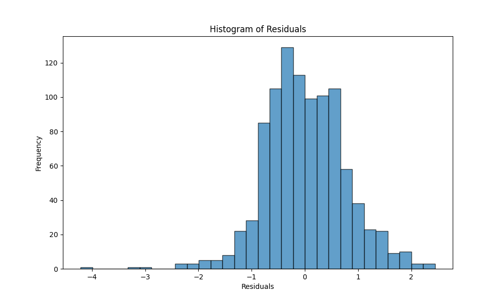

# Statistical Inference Project 2

Under the supervision of Prof. Ayon Ganguly,\
Department of Mathematics, IIT Guwahati.

## Objective

Perform regression analysis by:

- Performing point and interval estimation of all parameters
- Testing the significance of the regression
- Conducting residual analysis
- Performing subset selection
- Finding adjusted R2
- Detecting multicollinearity

## Dataset

We have taken the dataset from UC Irvine Machine Learning Repository. The dataset is related to red and white variants of the Portuguese "Vinho Verde" wine. The dataset can be found [https://archive.ics.uci.edu/dataset/186/wine+quality](https://archive.ics.uci.edu/dataset/186/wine+quality).
related research paper can be found [https://www.sciencedirect.com/science/article/pii/S0167923609001377?via%3Dihub](https://www.sciencedirect.com/science/article/pii/S0167923609001377?via%3Dihub). \
This dataset contains 2 files:

- winequality-red.csv
- winequality-white.csv

we have taken the white wine dataset for our analysis.

### Description of the dataset

The dataset consists of 12 columns and 4898 rows. The columns are as follows:

1. fixed acidity
2. volatile acidity
3. citric acid
4. residual sugar
5. chlorides
6. free sulfur dioxide
7. total sulfur dioxide
8. density
9. pH
10. sulphates
11. alcohol
12. quality

No missing values are present in the dataset.
first 5 rows of the dataset are as follows:
| fixed acidity | volatile acidity | citric acid | residual sugar | chlorides | free sulfur dioxide | total sulfur dioxide | density | pH  | sulphates | alcohol | quality |
|---------------|------------------|-------------|----------------|-----------|---------------------|----------------------|---------|-----|-----------|---------|---------|
| 7.0           | 0.27             | 0.36        | 20.7           | 0.045     | 45.0                | 170.0                | 1.0010  | 3.00| 0.45      | 8.8     | 6       |
| 6.3           | 0.30             | 0.34        | 1.6            | 0.049     | 14.0                | 132.0                | 0.9940  | 3.30| 0.49      | 9.5     | 6       |
| 8.1           | 0.28             | 0.40        | 6.9            | 0.050     | 30.0                | 97.0                 | 0.9951  | 3.26| 0.44      | 10.1    | 6       |
| 7.2           | 0.23             | 0.32        | 8.5            | 0.058     | 47.0                | 186.0                | 0.9956  | 3.19| 0.40      | 9.9     | 6       |
| 7.2           | 0.23             | 0.32        | 8.5            | 0.058     | 47.0                | 186.0                | 0.9956  | 3.19| 0.40      | 9.9     | 6       |

## Analysis

The analysis of the dataset is as follows:

| Statistic | fixed acidity | volatile acidity | citric acid | residual sugar | chlorides | free sulfur dioxide | total sulfur dioxide | density | pH  | sulphates | alcohol | quality |
|-----------|---------------|------------------|-------------|----------------|-----------|---------------------|----------------------|---------|-----|-----------|---------|---------|
| count     | 4898.000000   | 4898.000000      | 4898.000000 | 4898.000000    | 4898.000000 | 4898.000000        | 4898.000000         | 4898.000000 | 4898.000000 | 4898.000000 | 4898.000000 | 4898.000000 |
| mean      | 6.854788      | 0.278241         | 0.334192    | 6.391415       | 0.045772    | 35.308085           | 138.360657          | 0.994027    | 3.188267    | 0.489847    | 10.514267   | 5.877909    |
| std       | 0.843868      | 0.100795         | 0.121020    | 5.072058       | 0.021848    | 17.007137           | 42.498065           | 0.002991    | 0.151001    | 0.114126    | 1.230621    | 0.885639    |
| min       | 3.800000      | 0.080000         | 0.000000    | 0.600000       | 0.009000    | 2.000000            | 9.000000             | 0.987110    | 2.720000    | 0.220000    | 8.000000    | 3.000000    |
| 25%       | 6.300000      | 0.210000         | 0.270000    | 1.700000       | 0.036000    | 23.000000           | 108.000000           | 0.991723    | 3.090000    | 0.410000    | 9.500000    | 5.000000    |
| 50%       | 6.800000      | 0.260000         | 0.320000    | 5.200000       | 0.043000    | 34.000000           | 134.000000           | 0.993740    | 3.180000    | 0.470000    | 10.400000   | 6.000000    |
| 75%       | 7.300000      | 0.320000         | 0.390000    | 9.900000       | 0.050000    | 46.000000           | 167.000000           | 0.996100    | 3.280000    | 0.550000    | 11.400000   | 6.000000    |
| max       | 14.200000     | 1.100000         | 1.660000    | 65.800000      | 0.346000    | 289.000000          | 440.000000           | 1.038980    | 3.820000    | 1.080000    | 14.200000   | 9.000000    |

correlation matrix of the dataset is as follows:

|                 | fixed acidity | volatile acidity | citric acid | residual sugar | chlorides | free sulfur dioxide | total sulfur dioxide | density | pH  | sulphates | alcohol | quality |
|-----------------|---------------|------------------|-------------|----------------|-----------|---------------------|----------------------|---------|-----|-----------|---------|---------|
| fixed acidity   | 1.000000      | -0.022697        | 0.289181    | 0.089021       | 0.023086  | -0.049396           | 0.091070             | 0.265331| -0.425858| -0.017143| -0.120881| -0.113663|
| volatile acidity| -0.022697     | 1.000000         | -0.149472   | 0.064286       | 0.070512  | -0.097012           | 0.089261             | 0.027114| -0.031915| -0.035728| 0.067718| -0.194723|
| citric acid     | 0.289181      | -0.149472        | 1.000000    | 0.094212       | 0.114364  | 0.094077            | 0.121131             | 0.149503| -0.163748| 0.062331| -0.075729| -0.009209|
| residual sugar  | 0.089021      | 0.064286         | 0.094212    | 1.000000       | 0.088685  | 0.299098            | 0.401439             | 0.838966| -0.194133| -0.026664| -0.450631| -0.097577|
| chlorides       | 0.023086      | 0.070512         | 0.114364    | 0.088685       | 1.000000  | 0.101392            | 0.198910             | 0.257211| -0.090439| 0.016763| -0.360189| -0.209934|
| free sulfur dioxide| -0.049396  | -0.097012        | 0.094077    | 0.299098       | 0.101392  | 1.000000            | 0.615501             | 0.294210| -0.000618| 0.059217| -0.250104| 0.008158|
| total sulfur dioxide| 0.091070  | 0.089261         | 0.121131    | 0.401439       | 0.198910  | 0.615501            | 1.000000             | 0.529881| 0.002321| 0.134562| -0.448892| -0.174737|
| density         | 0.265331      | 0.027114         | 0.149503    | 0.838966       | 0.257211  | 0.294210            | 0.529881             | 1.000000| -0.093591| 0.074493| -0.780138| -0.307123|
| pH              | -0.425858     | -0.031915        | -0.163748   | -0.194133      | -0.090439 | -0.000618           | 0.002321             | -0.093591| 1.000000| 0.155951| 0.121432| 0.099427|
| sulphates       | -0.017143     | -0.035728        | 0.062331    | -0.026664      | 0.016763  | 0.059217            | 0.134562             | 0.074493| 0.155951| 1.000000| -0.017433| 0.053678|
| alcohol         | -0.120881     | 0.067718         | -0.075729   | -0.450631      | -0.360189 | -0.250104           | -0.448892            | -0.780138| 0.121432| -0.017433| 1.000000| 0.435575|
| quality         | -0.113663     | -0.194723        | -0.009209   | -0.097577      | -0.209934 | 0.008158            | -0.174737            | -0.307123| 0.099427| 0.053678| 0.435575| 1.000000|

Data visualization of the dataset is as follows:
<div style="display: flex; justify-content: center;">
    
    
</div>
<div style="display: flex; justify-content: center;">
    
    
</div>
<div style="display: flex; justify-content: center;">
    
    
</div>
<div style="display: flex; justify-content: center;">
    
    
</div>
<div style="display: flex; justify-content: center;">
    
    
</div>
<div style="display: flex; justify-content: center;">
    
</div>
correlation matrix plot of the dataset is as follows:


### 1. Point and Interval Estimation of all parameters

we have considered the quality of the wine as the dependent variable and all other variables as independent variables. Now we have fitted a multiple linear regression model to the dataset using scikit-learn for estimating the parameters.

```math
\begin{align*}
& y=\beta_0+\beta_1x_1+\beta_2x_2+\beta_3x_3+\beta_4x_4+\beta_5x_5+\beta_6x_6+\beta_7x_7+\beta_8x_8+\beta_9x_9+\beta_{10}x_{10}+\beta_{11}x_{11}
\end{align*}
```

it uses the normal equation for estimating the parameters internally.

```math
\begin{align*}
&\beta=(X^TX)^{-1}X^Ty
\end{align*}
```

where $X$ is the design matrix and $y$ is the response vector.

 The estimated parameters are as follows:

```math
\begin{align*}
&\beta_0 = 124.3939 \\ 
&\beta_1 = 0.0459\\ 
&\beta_2 = -1.9149\\ 
&\beta_3 = -0.0613 \\ 
&\beta_4 = 0.0712\\ 
&\beta_5 = -0.0265\\ 
&\beta_6 = 0.00511\\ 
&\beta_7 = -2.42\times 10^{-4}\\ 
&\beta_8 = -124.2641\\ 
&\beta_9 = 0.6007\\ 
&\beta_{10} = 0.6491\\ 
&\beta_{11} = 0.2290
\end{align*}
```

We estimate the confidence intervals of the parameters using the given formula:

```math
\begin{align*}
&[\beta_j - t_{\frac{\alpha}{2},n-p-1}\sqrt{MS_{Res}C_{jj}},\beta_i + t_{\frac{\alpha}{2},n-p-1}\sqrt{MS_{Res}C_{jj}}]
\end{align*}
```

where $MS_{Res}$ is the residual mean square and $C_{jj}$ are the diagonal entries of $(X^T X)^{-1}$. But our sample size is large enough, so we can use the normal distribution for calculating the confidence intervals. \
The confidence intervals of the parameters are as follows:

```math
\begin{align*}
&\beta_0 \in [84.7696 ,164.0182]\\
&\beta_1 \in [0.0005 ,0.0914]\\
&\beta_2 \in [-2.1621 , -1.6677]\\
&\beta_3 \in [-0.2738,0.1512]\\
&\beta_4 \in [0.0552,0.0873]\\
&\beta_5 \in [-1.2230,1.1700]\\
&\beta_6 \in [0.0032,0.0070]\\
&\beta_7 \in [-0.0011,0.0006]\\
&\beta_8 \in [-164.4767,-84.0515]\\
&\beta_9 \in [0.3701,0.8313]\\
&\beta_{10} \in [0.4284,0.8701]\\
&\beta_{11} \in [0.1777,0.2803]
\end{align*}
```

For estimating the confidence intervals of the parameters, we have used statsmodels library.

### 2. Testing the significance of the regression

We have tested the significance of the regression using the F-test. The null hypothesis is that all the parameters are zero. The alternative hypothesis is that at least one parameter is non-zero. The F-statistic is calculated as follows:

```math
H_{0}:\beta_1=\beta_2=...=\beta_p=0
```

```math
H_{1}:\beta_j\ne 0 \text{  for some j}
```

```math
\begin{align*}
&F_0=\frac{SS_{Reg}/p}{SS_{Res}/(n-p-1)} \sim F(p,n-p-1), \text{under } H_0
\end{align*}
```

where $SS_{Reg}$ is the regression sum of squares and $SS_{Res}$ is the residual sum of squares. The F-statistic is compared with the critical value of the F-distribution for the given significance level and degrees of freedom. If the F-statistic is greater than the critical value, then we reject the null hypothesis. The F-statistic is 141.1 and the critical value is 1.7906. **So we reject the null hypothesis**.

**Conclusion: At least one independent variable is contributing to the explanation of the dependent variable.**

### 3. Residual Analysis

We have divided the dataset into training and testing datasets. We have fitted the model to the training dataset and predicted the values of the testing dataset. The residuals are calculated as the difference between the actual values and the predicted values. The residuals are plotted against the predicted values. The residuals are normally distributed as we can see in the Q-Q plot and the other plots. The residuals are plotted against the predicted values.




```math
\begin{align*}
& SS_{total}= 758.9837\\
& SS_{Res}= 557.6443\\
& SS_{Reg}= 201.3393\\
& MS_{Res}= 0.5761\\
& MS_{Reg}= 16.7782
\end{align*}
```

### 4. Finding Adjusted R2

The adjusted R2 is calculated as follows:

```math
\begin{align*}
& R^2_{adj}=1-\frac{SS_{Res}}{SS_{Total}}\times\frac{n-1}{n-p-1}\\
& R^2=1-\frac{SS_{Res}}{SS_{Total}}
\end{align*}
```

where

```math
\begin{align*}
& SS_{Total}=\sum_{i=1}^{n}(y_i-\bar{y})^2\\
& SS_{Res}=\sum_{i=1}^{n}(y_i-\hat{y_i})^2
\end{align*}
```

where $SS_{Total}$ is the total sum of square. $SS_{Res}$ is the residual sum of square. $n$ is the number of observations and $p$ is the number of parameters.

```math
\begin{align*}
& R^2_{adj}=0.282 \\
& R^2=0.284
\end{align*}
```

### 5. Variable Selection

Among the large number of possible explanatory variables, we wish to select those which explain the observed responses the best. This way, we can decrease the number of predictors (giving a parsimonious model) and get good predictive power by eliminating redundant variables.
In this section, we briefly present three methods for variable selection.

#### 5.1 Forward Selection

The forward selection method is an iterative method. In the first iteration we consider
which feature f1 is the most significant in terms of its P-value for the F-test with f1 ∈ $\{x_1, x_2,. . . ,x_p\}$. This feature is then selected into the model. In the second iteration, the feature f2 that has the smallest P-value, where f2 , f1, and so on. Usually only features are selected that have a P-value of at most 0.05. To carry out a forward selection procedure.

From this procedure we get:
**['alcohol', 'volatile acidity', 'residual sugar', 'free sulfur dioxide', 'density', 'pH', 'sulphates', 'fixed acidity']**

#### 5.2 Backward Selection

This time, we start with the complete model and at each step, we delete the variable with lowest value of Student’s test statistic (largest P-value) in absolute value, as long as it is not significant (at a specified level $α$).

From this procedure we get:
**['fixed acidity', 'volatile acidity', 'residual sugar', 'free sulfur dioxide', 'density', 'pH', 'sulphates', 'alcohol']**

#### 5.3 Step-Wise Selection

1. Start with an Empty Model or Full Model:

- You can start with either an empty model (no predictors) or a full model (all predictors included).

2. Iterate:

- Perform both forward selection and backward elimination iteratively.
- At each step, evaluate whether adding or removing a predictor variable improves the model based on the chosen criterion.
- Stop the iteration when no further improvement is observed or when predefined stopping criteria are met (e.g., no variables meet the criteria for inclusion or removal).

From this procedure we get:
**['alcohol', 'volatile acidity', 'residual sugar', 'free sulfur dioxide', 'density', 'pH', 'sulphates', 'fixed acidity']**

### 6. Multicolliearity

- **Introduction**
Multicollinearity is a phenomenon in regression analysis where independent variables are highly correlated with each other, which can impact the interpretation and reliability of regression results.

- **Multicollinearity Assessment**
The Variance Inflation Factor (VIF) was employed to assess multicollinearity among the independent variables in the regression model.

```math
Var(\hat{\beta_j}) = \sigma^2C_{jj}, C = (X'X)^{-1}
```

```math
c_{jj} = (1-R_j^2)^{-1} = \frac{1}{1-R_j^2} 
```

where $R_j^2$ is the coefficient of determination obtained when xj is regressed on remaining (k − 1) regressors.

$\text{VIF}_j = \frac{1}{1-R_j^2}$

This measures the factor by which the variance of $\beta^j$ inflated due to the near linear dependence.

VIF values above a certain threshold (commonly 10) indicate multicollinearity.

Highlight any variables with high VIF values, indicating strong collinearity with other variables in the model

- **Results**
The following table displays the VIF values for each independent variable:

| Variable | VIF Value |
|----------|-----------|
|fixed acid  | 92.86       |
| volatile acidity         | 9.730      |
| citric acid  |  10.01      |
|residual sugar  |   3.830     |
| ...      | ...       |

Variables with VIF values exceeding the threshold of 10 indicate multicollinearity, suggesting strong correlations with other variables in the model.

- **Discussion**
Multicollinearity can lead to inflated standard errors, unreliable hypothesis tests, and challenges in interpreting regression coefficients.

- **Conclusion**
The assessment of multicollinearity underscores its importance in regression analysis. Strategies for addressing multicollinearity, such as dropping highly correlated variables or using regularization techniques, may be necessary to ensure the reliability of regression results.
